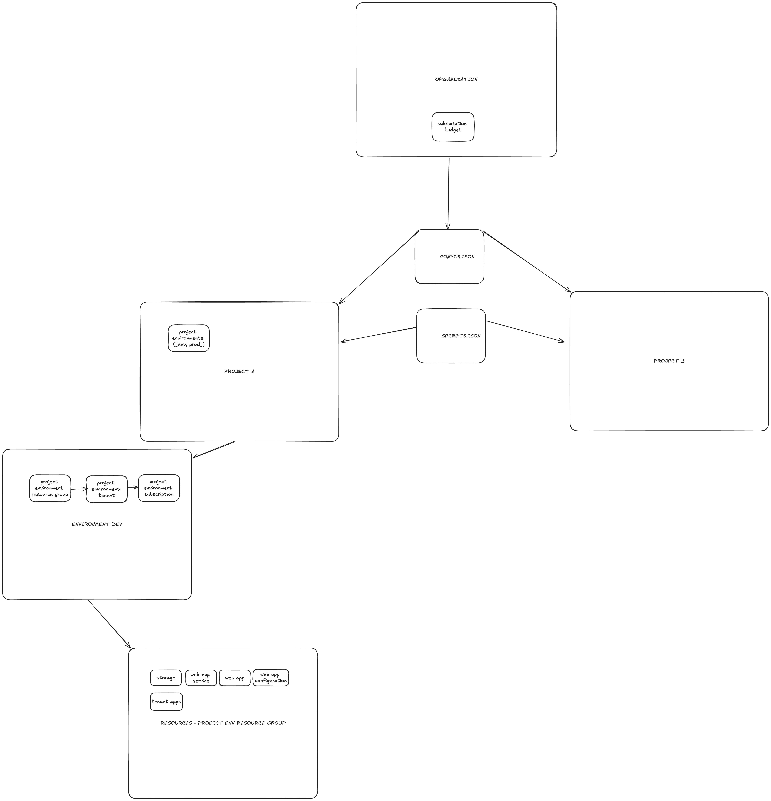

sample setup:


// TODO:

-
- setup tenant application such as ProxyIdentityExperienceFramework and IdentityExperienceFramework, Web api and SPA client, upload Identity Experience Framework Custom Policies, Setup Policies Encryption and Singing Containers
- create programatically Github service principal - on org level for start
- setup CI/CD working github actions pipeline with provided input params (env)
- create db
- create computer vision resource - find the way accept EULA programatically
- mark @secure parameters
- move resource map to config.json

1. Install Azure CLI

```
https://learn.microsoft.com/en-us/cli/azure/install-azure-cli

// check version
az --version

// update
az upgrade

// P.S.
login into cli after you set all neccessary permissions for your user

```

2. Permissions

```
// elevate as Global Administrator
https://learn.microsoft.com/en-us/azure/role-based-access-control/elevate-access-global-admin?tabs=azure-portal

// add required permissions read:
https://github.com/Azure/Enterprise-Scale/wiki/ALZ-Setup-azure

// add congitive contributor role to user

or

// assign Owner role at Tenant root scope ("/") as a User Access Administrator to current user (gets object Id of the current user (az login))
az role assignment create --scope '/' --role 'Owner' --assignee-object-id $(az ad signed-in-user show --query id --output tsv) --assignee-principal-type User

or

Open Microsoft Entra ID ->  Under Manage, select Properties. -> Under Access management for Azure resources, set the toggle to Yes.


// payment permissions elevate for user as billing profile owner
https://learn.microsoft.com/en-us/azure/cost-management-billing/manage/view-all-accounts
```

3. Login / logout

```
az login
or
az login --use-device-code

// verify you logged for correct user
az ad signed-in-user show

az logout

```

7. Create Service principal and update github secrets with output

```
spn_displayname='GitHubActions'
az ad sp create-for-rbac --name $spn_displayname

in the following format:
{
    "clientSecret":  "******",
    "subscriptionId":  "******",
    "tenantId":  "******",
    "clientId":  "******"
}

az role assignment create --scope '/' --role 'Owner' --assignee-object-id $(az ad sp list --display-name "$spn_displayname" --query '[].id' -o tsv) --assignee-principal-type ServicePrincipal

DONT FORGET to add in portal for created SP ->
Certificates & secrets -> Add credential -> setup github actions and repository

```

```
#sign into AZ CLI, this will redirect you to a webbrowser for authentication, if required
az login

#tenant level principal
az ad sp create-for-rbac --name GithubActions --role contributor --scopes /providers/Microsoft.AzureActiveDirectoryB2C/b2cDirectories/{tenant_name}

#assign Owner role at Tenant root scope ("/") as a User Access Administrator to current user (gets object Id of the current user (az login))
az role assignment create --scope '/' --role 'Owner' --assignee-object-id $(az ad signed-in-user show --query id --output tsv) --assignee-principal-type User

#(optional) assign Owner role at Tenant root scope ("/") as a User Access Administrator to service principal (set spn_displayname to your service principal displayname)

spn_displayname='GitHubSP'
az role assignment create --scope '/' --role 'Owner' --assignee-object-id $(az ad sp list --display-name "$spn_displayname" --query '[].id' -o tsv) --assignee-principal-type ServicePrincipal
```

8. Helpfull commands

```
// signed in user id
az ad signed-in-user show --query id --output tsv

// list managment-group
az account management-group list

// list subscriptions
az account subscription list

// query list subscriptions
subscriptionId=$(az account subscription list --query "[?contains(displayName, '$projectName')].subscriptionId" --output tsv)
echo $subscriptionId

// set subscription context
az account set --subscription "xxxxxxxx-xxxx-xxxx-xxxx-xxxxxxxxxxxx"

// list tenants
az account tenant list

// current subscription context
az account show --query name


// list locations
az account list-locations

// payment account info
billingAccountName=$(az billing account list --query "[0].name" -o tsv)
echo $billingAccountName

billingProfileName=$(az billing account list-invoice-section --billing-account-name "$billingAccountName" --query "[0].billingProfileSystemId" -o tsv)
echo $billingProfileName

invoiceSectionName=$(az billing account list-invoice-section --billing-account-name "$billingAccountName" --query "[0].invoiceSectionSystemId" -o tsv)
echo $invoiceSectionName


// remove ALL tenant level deployments
for deployment in $(az deployment tenant list --query "[].{name:name}" -o tsv); do
  az deployment tenant delete --name $deployment
done

// remove ALL sub level deployments
for deployment in $(az deployment sub list --query "[].{name:name}" -o tsv); do
  az deployment sub delete --name $deployment
done

```
